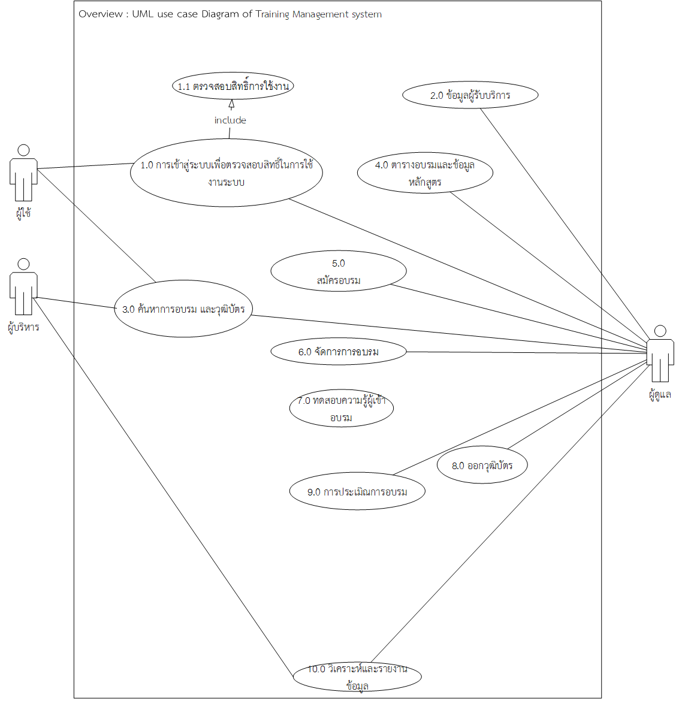

# Lpru Training Manager system
# <space>
## Development Environtment   
### FrontEnd
Node:[] !Alpine
MongoDB [mongo-express "DataStore Manager tool", Rest API "Application programming interface for Data Query" ] ! Alpine
#### Base on Linux Alpine3.6
# <space>
### BackEnd 
##### Nginx : "webroxy" 
PHP-FPM "Programming Language"   
HHVM "Open Source Virtual Machine based on JIT"
Mysql "Original Data Source"
#### Base on ubuntu-xenial v.16
# <space>
# Log
# note 09-13-2017
 Usecase Diagram : Overview beta version Current update 09-13-2017
 

# Update 09-14-2017 
Building Frontend Uncompleted, Fail Mongo configuration
